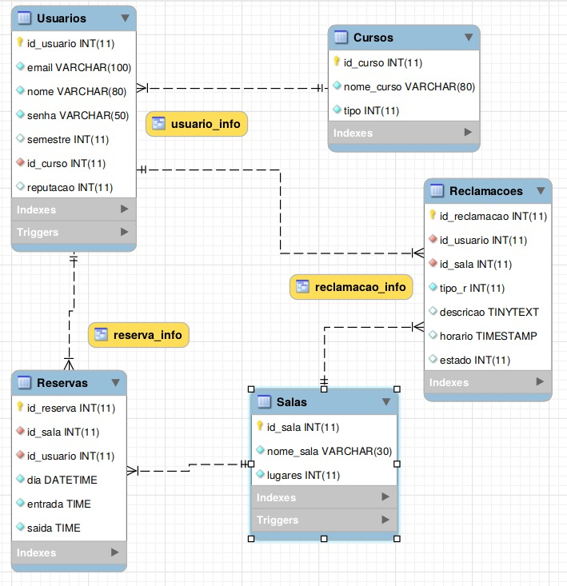

# Room Reservations
#### Bruna Kimura, Leonardo Medeiros e Martim José - Engenharia da Computação Insper 2018

## Introdução
A aplicação consiste em um sistema de reserva de salas de estudo da biblioteca do Insper.
A reserva de salas de estudo no Insper é uma grande dificuldade. Normalmente elas sempre estão lotadas e é bastante difícil achar alguma disponível. Para encontrar uma sala é necessário descer até o térreo onde se localiza as salas e passar na frente de todas as salas até encontrar uma disponível. Essa forma de encontrar salas não é eficiente, pois é utilizado muito tempo andando entre as salas (e geralmente não é possível encontrar alguma disponível), além de que não é possível saber se alguma sala ficou disponível. Outro ponto, é a falta de informação sobre quem utiliza essas salas.
Para garantir que os usuários da aplicação usem-a adequadamente, é possível implementar um sistema de reputação, que implica em penalidades para aqueles que tiverem baixa reputação. Por exemplo, se a pessoa que usou a sala antes de um usuário deixou ela bagunçada e suja, o usuário pode relatar isso pelo aplicativo e a pessoa teria sua reputação diminuída. O mesmo pode acontecer para pessoas que não obedecem as regras de convivência da biblioteca e funcionamento da aplicação. A reputação do aluno está diretamente ligada ao quanto de tempo que ele pode reservar a sala, quanto maior a reputação mais tempo de reserva.
Sabendo dessa situação, foi pensado em uma forma de disponibilizar se uma sala de estudo está disponível ou não a partir de um site. Já para o Insper é possível ter informações sobre a demanda dessas salas e sobre os alunos que as utilizaram.

## O que é possível fazer:

Criar um usuário, com login (Insper) e senha;
Editar perfil, (nome, email, senha);
Visualizar salas disponíveis e reservadas;
Reservar uma sala (qual sala e horário);
Avaliar a limpeza e organização da sala, deixada pelo aluno anterior;
Visualizar a reputação;
Abrir reclamação de barulho ou descomprimento de regras ocorrendo em outra sala;
Reportar problemas técnicos em relação a mobília, TV, tomadas e ar condicionado.

## Instalação
Para iniciar esse projeto é necessário que a máquina tenha já tenha instalado o node.js e o MySQL. Após clonar o repositório, é preciso dar `npm install` na pasta principal e na pasta frontend.

Já para o banco de dados é necessário rodar os arquivos ‘db_schema.sql’ para gerar o banco de dados e o ‘db_extras.sql’ para criar as funções utilizadas no código. Para verificar se o banco de dados está funcionando pode-se usar o arquivo ‘db_data.sql’ que possui alguns dados para inserção.

Após instalar as dependências e executar os scripts do banco de dados, é preciso criar as variáveis de ambiente que contém as informações a respeito do banco de dados. Para isso, crie um arquivo chamado `.env` na pasta principal (RoomReservations) e coloque o seguinte conteúdo, fazendo as devidas alterações:

    DB_HOST = localhost
    DB_USER = root
    DB_PASS = SuaSenha
    DB_NAME = RoomReservations
    ENV_PORT = 3001

Como `.gitignore` não adiciona arquivos `.env` ao repositório, as informações sṍ existem no seu ambiente de trabalho, vide o nome.

Agora na pasta frontend, execute o comando `npm start`, e na pasta principal execute o comando `node app.js`. Isso executará o web server e o backend, respectivamente. Caso o navegador não inicie automaticamente na página, acesse o endereço `localhost:3001`.

## O projeto
* Navegador
* Webserver
* Backend
* Microserviço
* Banco de dados

### Banco de dados
O banco de dados está dividido em três arquivos:
* db_schema.sql (script com o banco de dados)
* db_extras.sql (script com procedures, functions, triggers e views)
* db_data.sql (alguns exemplos de inserção)

**Diagrama E-R**

* **Dicionário**

[Dicionário](./master/database/dicionario.md)

### Micro serviço
**Rotas**
- [Rotas de usuário](../master/routes/user_route.md)

- [Rotas de reserva](../master/routes/reserva_route.md)

- [Rotas de reclamação](../master/routes/reclamacao_route.md)

- [Rotas de curso](../master/routes/curso_route.md)

- [Rotas de sala](../master/routes/sala_route.md)

**Como testar as rotas da aplicação:**

Para testar somente as rotas pode-se usar a aplicação Postman. Para tanto, basta instalá-lo a partir do link: https://gist.github.com/posemon/edda642902161da244a5fe523fcbce43.

Certifique-se que o backend esteja rodando. No programa, selecione se a requisição é um POST, GET, PUT OU DELETE, insira a URL da rota e coloque no body da requisição (se for necessário) as informações. Ao enviar (‘send’) a resposta aparecerá em JSON correspondente àquela requisição.

### Web Server

